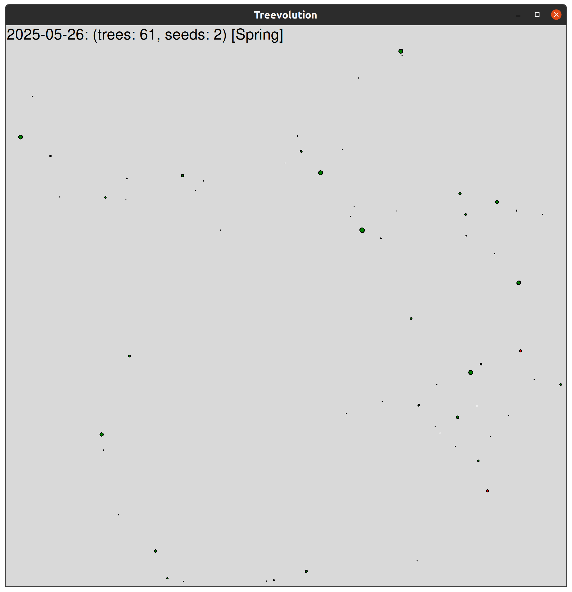
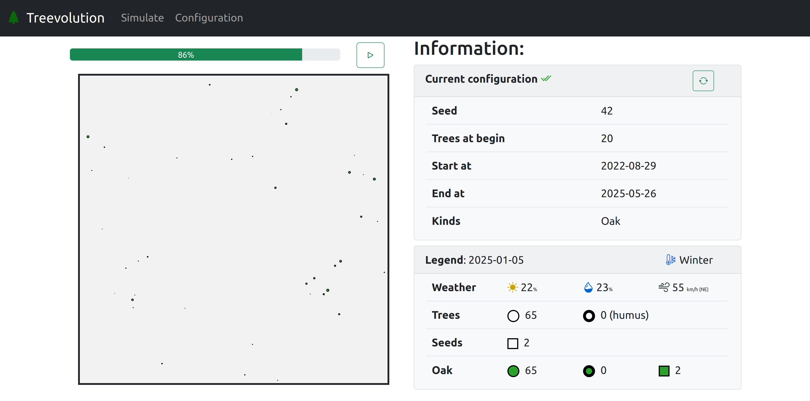

# Treevolution

## Description

Python package for forest evolution.

**Author:** Espoir HOUEDJI

## Resources

- Course link: [https://jeromebuisine.fr/teaching/#2023---2024](https://jeromebuisine.fr/teaching/#2023---2024)
- Google Sheet link: [add your project information here](https://docs.google.com/spreadsheets/d/1xf7LQNiBoHZfaF7jK0HH1mBZsTCs2RTuqb3lEnR4LDE/edit?usp=sharing)

## Application overview

## Web site overview

#BADGE

 

 

